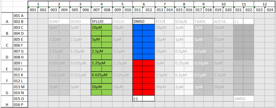

# Tox-CNN
Tox_CNN is a python-based tool for in vitro screening of drug-induced toxicity. 

## Description
Tox_CNN makes use of Convolutional Neural Netwoks (CNN) to predict toxicity state of cells under different treatments from microscopy images of simple fluorescently labeled nuclei.

## Software requirements
The tool was implemented as a script in Python and it was tested only in Windows 7 and 10:
- Anaconda x64 with Python 3.5
- Visual Studio Community 2013 with update 5
- MinGW-w64 5.4.0 realease
- Python packages needed and the corresponding versions can be found in "requirements.txt" file

Additionally, GPU processing is supported to speed up computations:
- CUDA 8.0
- CuDNN 8.0

## Installation
[Install Keras, Theano and Dependencies](https://ankivil.com/installing-keras-theano-and-dependencies-on-windows-10/) following instructions in the link.

## Parameters
To check the list of input parameters to run the tool, together with their descriptions:
```
$ python Tox_CNN.py --help
```

The main input (-i) should be a table containing at least 2 columns containing:
- Paths to single-cell images (--path_column)
- Label (HEALTHY or TOXICITY_AFFECTED) for each cell [only in training mode] (--label_column)

## Modes
- Test: Prediction of toxicity state (HEALTHY or TOXICITY_AFFECTED) of cells using a pretrained model.
- Train: Create a model for prediction of toxicity state (HEALTHY or TOXICITY_AFFECTED) of cells.
- Transfer Learning: Fine tune a pretrained model to be adapted for prediction of toxicity state of cells in a different scenario.

## Example
An example is provided to test the tool. It corresponds to a part of a toxicity-screening plate containing fluorescent images of cells labeled with DAPI under three diferent conditions
- Untreated cells
- DMSO
- Cells treated with 5FLUO drug at different concentrations
# 

Files provided:
- Tables: One row/cell including path to corresponding single-cell image (PATH_Crop_Nuc), HEALTHY or TOXICITY_AFFECTED label (CLASS) and template information comming from the plate structure (well, row, column, field, cell ID, cell line, treatment, concentration and train/test set):
	- Example_1drug_TEST.csv - Table for test including information about all cells.
	- Example_1drug_TRAINING.csv - Table for training including information about a subset of cells.
- Images:
	- IMAGES/CROPS - Zip file containing all single-cell images refered in tables. [Unzip before running the tests]
- Pretrained model:
	- MODELS/Tox_CNN_mixed_model.hdf5 - Mixed model pretrained for toxicity prediction in HL1 cells stained with DAPI.

## Running the example
Test:
```
$ python Tox_CNN.py -i "Example/Example_1drug_TEST.csv" -o "Example/TEST_Example_Tox_CNN" --image_size 50 50 --in_memory --model_fname "Example/MODELS/Tox_CNN_mixed_model.hdf5"
```

Train:
```
$ python Tox_CNN.py -i "Example/Example_1drug_TRAINING.csv" -o "Example/MODEL_Example_Tox_CNN" --image_size 50 50 --in_memory --epochs 120 -v
```

Transfer learning:
```
$ python Tox_CNN.py -i "Example/Example_1drug_TRAINING.csv" -o "Example/TRANSFERMODEL_Example_Tox_CNN" --image_size 50 50 --in_memory --epochs 25 --model_fname "Example/MODELS/Tox_CNN_mixed_model.hdf5" --net_tune -v
```